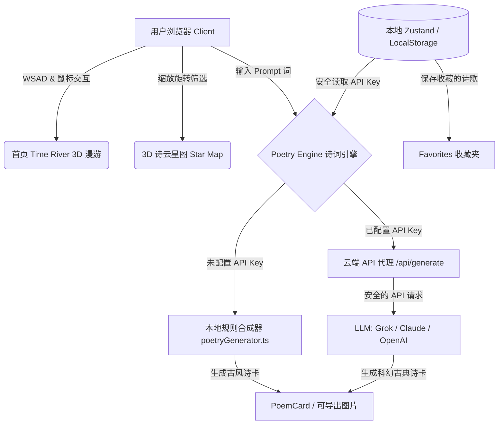

# 诗云 · Poem Cloud

> **“技术能穷尽所有诗，但能否穷尽美？” —— 刘慈欣《诗云》**

`诗云 (Poem Cloud)` 是一款融合了**科幻哲思**、**古典诗词意境**与**现代 3D 视觉技术**的极致暗黑宇宙风 Web 应用程序。我们基于 [Next.js 15](file:///home/enengr/projects/A2026/poem-cloud/package.json) + TypeScript + React Three Fiber + TailwindCSS 构建，打造了一个供用户在太空中翱翔、探索中华诗词文明的交互空间。

---

## 🌌 核心板块与视觉呈现

### 1. 🌊 三维时间之河 (Time River)
部署在应用首页，展示了一条在太空中蜿蜒流淌的“历史时间之河”，象征中国古代诗词文化的连绵不绝。
* **古风 3D 渲染**：两岸漂浮着古风艺术牌匾（Plaque Style，金边与朱红色诗人印章印记）、竹简诗词（Bamboo Slip Style，淡蓝色发光虚线排版）以及神秘的太极/古琴底座。
* **沉浸式飞行控制**：
  * **自动漫游**：默认沿着平滑的 `CatmullRomCurve3` 样条曲线进行时空翱翔。
  * **键盘干预 (WSAD)**：
    * `W` 键：太空舱加速前行；
    * `S` 键：减速慢行观赏两岸诗词；
    * `A` / `D` 键：控制镜头向左/向右侧滑转向，掠过星空；
  * **鼠标交互**：镜头焦点随鼠标指针平滑偏移，带来真实的侧倾飞行质感。
* **天气与粒子系统**：基于自定义 `Shader` 与 Canvas 纹理构建的雪花粒子系统，在深邃的夜空中飘落着松软、发光的雪花。
* **核心组件**：[components/TimeRiver.tsx](file:///home/enengr/projects/A2026/poem-cloud/components/TimeRiver.tsx) & [app/page.tsx](file:///home/enengr/projects/A2026/poem-cloud/app/page.tsx)。

### 2. 🌌 交互式 3D 诗云星图 (Star Map)
以大尺度宇宙星图的方式将 79 位著名中国历史诗人及 91 条诗人之间的生平关系（如师友、政敌、唱和等）具象化。
* **空间分布**：采用 **斐波那契球分布算法 (Fibonacci Sphere Algorithm)**，使得 79 位诗人节点在三维宇宙空间中分布均匀而自然。
* **高阶后期特效**：集成了 `@react-three/postprocessing` 的 **Bloom (辉光)** 和 **Chromatic Aberration (色差)** 特效，营造赛博朋克与科幻感交织的夜空星河。
* **加色混合 (Additive Blending)**：星体连接线采用加色混合模式，带有柔和星云微光的半透明淡蓝色发光曲线，让关联网络宛若真实的太空星云。
* **诗歌与朝代筛选**：按诗人的创作数量渲染节点大小，并根据朝代进行颜色区分。点击诗人节点会平滑唤起精致的卡片弹窗，已修复移动端排版及遮挡问题。
* **核心组件**：[components/StarMap.tsx](file:///home/enengr/projects/A2026/poem-cloud/components/StarMap.tsx) & [app/star-map/page.tsx](file:///home/enengr/projects/A2026/poem-cloud/app/star-map/page.tsx)。

### 3. ✍️ 双引擎诗词生成器 (Poetry Engine)
页面的核心逻辑已剔除冗余 Vibe 概念，专为生成古典诗篇而设计，提供漂浮式星际卡片以及生成式太空意境。
* **双引擎架构**：
  * **本地核心引擎**：无密钥状态下自动启用的本地规则生成器 [lib/poetryGenerator.ts](file:///home/enengr/projects/A2026/poem-cloud/lib/poetryGenerator.ts)。它将意象词库、声律韵脚模型与经典诗牌模板结合，即时拼合出意境优美的五言/七言律绝。
  * **LLM 云端引擎**：当用户在设置页配置了 API 密钥（支持 Grok, Claude, OpenAI），请求将通过安全代理路由 [app/api/generate/route.ts](file:///home/enengr/projects/A2026/poem-cloud/app/api/generate/route.ts) 请求先进的生成大模型，返回蕴含现代科技与古典交融的诗篇。
* **核心组件**：[app/generator/page.tsx](file:///home/enengr/projects/A2026/poem-cloud/app/generator/page.tsx) & [components/PoemCard.tsx](file:///home/enengr/projects/A2026/poem-cloud/components/PoemCard.tsx)。

### 4. 📖 原著与哲思 (Philosophy & Lore)
阐述了《诗云》原著中大吞食者、伊甸园、低熵体以及“终极算力”的设定。
* **哲思对谈**：探讨了“大模型是否能穷尽诗歌的美”这一现代议题，完美融合了刘慈欣的硬核科幻概念和大语言模型的发展哲学。
* **核心页面**：[app/story/page.tsx](file:///home/enengr/projects/A2026/poem-cloud/app/story/page.tsx)。

---

## 🛠️ 项目技术架构

以下是 `诗云` 的核心技术调用流图：



### 关键目录结构
```bash
app/
  layout.tsx            # 全局导航栏 Nav 与布局
  page.tsx              # 首页：时间之河 TimeRiver 承载页
  star-map/page.tsx     # 3D 诗云星图页面
  generator/page.tsx    # 双引擎诗歌生成器
  story/page.tsx        # 《诗云》原著背景与科幻哲思
  explore/page.tsx      # 诗人与关系网名录探索页
  favorites/page.tsx    # 用户收藏的生成的诗篇
  settings/page.tsx     # LLM API 密钥与生成参数配置（纯本地存储）
  api/generate/route.ts # LLM API 安全路由代理
components/
  TimeRiver.tsx         # 首页 3D 时间之河组件
  StarMap.tsx           # 3D 星图核心渲染组件
  PoemCard.tsx          # 诗歌卡片，支持 html2canvas 图片导出
  ui/                   # 基于 Radix UI + shadcn 构建的粒子与框架组件
lib/
  poetryGenerator.ts    # 本地高质量古诗词声韵生成算法
  store.ts              # zustand 状态管理 (包含 API Key 及收藏诗歌持久化)
data/
  poets.json            # 79 位著名中国历史诗人数据
  poems.json            # 每位诗人精选代表作
  relations.json        # 91 条诗人社交/历史网络连线关系
```

---

## 🚀 本地开发与运行

### 1. 启动项目

确保你已安装 `Node.js 18+`，在项目根目录下执行：

```bash
# 安装依赖
npm install

# 运行本地开发服务器
npm run dev
```

运行成功后，在浏览器中打开：[http://localhost:3000](http://localhost:3000)

### 2. 真实历史数据重新生成/扩充

项目已内置极其丰富的诗人与网络关系。如果你需要重新扩充、更新或清洗本地数据：

```bash
# 运行数据构建脚本（将基于已配置的过滤器重新整合 data/ 中的内容）
npx tsx scripts/prepare-data.ts
```

> [!TIP]
> 如果你需要获取更庞大的完整中国诗歌库数据，可以克隆外部仓库并在本地重新跑生成脚本：
> ```bash
> git clone https://github.com/chinese-poetry/chinese-poetry.git /tmp/chinese-poetry
> npx tsx scripts/prepare-data.ts /tmp/chinese-poetry
> ```

---

## 🔑 LLM 安全机制

1. 用户填写的所有 API 密钥（如 Grok, Claude, OpenAI）均通过 [lib/store.ts](file:///home/enengr/projects/A2026/poem-cloud/lib/store.ts) 安全地持久化在用户的**浏览器本地 `localStorage`** 中。
2. 服务器端不留存任何密钥。在生成诗歌时，前端会将密钥放入请求头发送给 Next.js 路由代理 [app/api/generate/route.ts](file:///home/enengr/projects/A2026/poem-cloud/app/api/generate/route.ts) 转发至官方模型端，确保无泄露风险。
3. 即使在没有填写任何密钥的情况下，应用也默认通过本地规则生成器优雅生成诗词，不影响基础核心体验。

---

## 🐳 Azure 虚拟主机 & Docker 独立部署

项目根目录下已配置好优化过的多阶段构建 `Dockerfile`，支持以 standalone 独立运行模式部署。

### 1. 本地测试构建

```bash
docker build -t poem-cloud:latest .
docker run -p 3000:3000 --env-file .env.local poem-cloud:latest
```

### 2. 在 Azure 虚拟机部署

使用 SSH 登录至您的 Azure 虚拟机：

```bash
# 更新环境并安装 Docker
sudo apt update && sudo apt install -y docker.io git

# 将当前用户添加到 docker 组以避免使用 sudo
sudo usermod -aG docker $USER
newgrp docker

# 拉取最新的诗云代码
git clone <your-github-repo-url> poem-cloud
cd poem-cloud

# 启动 Docker 镜像编译
docker build -t shiyun:latest .

# 独立后台容器启动 (映射到 80 端口)
docker run -d \
  --name shiyun \
  -p 80:3000 \
  --restart unless-stopped \
  shiyun:latest
```

### 3. Vercel 自动化云部署

本项目已适配 Vercel 的原生 Next.js 架构：
* 每次通过 `git push` 提交代码至 GitHub 仓库时，关联的 Vercel 项目将**自动触发增量构建与部署**。
* 部署成功后，Vercel 会自动更新线上边缘路由节点。

---

## 📜 授权与致谢

* **致敬**：科幻作家刘慈欣先生的伟大短篇小说《诗云》。
* **数据来源**：感谢 [chinese-poetry](https://github.com/chinese-poetry/chinese-poetry) 提供的开源中国最全古诗词数据库。
* 所有古代伟大的诗词巨匠们。
